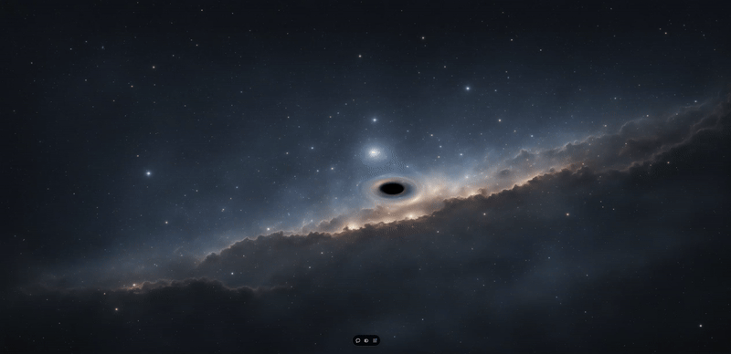

# Black Hole Visual Simulation

Welcome to the Black Hole Visual Simulation, an interactive project that demonstrates the gravitational effects of a black hole on a web page. In this simulation, the mouse cursor acts as a black hole, distorting the starry background as you move it across the screen, providing a visually stunning experience that simulates the curvature of spacetime.
### Table of Contents

- [Demo](#demo)
- [Project](#project)
- [Introduction](#introduction)
- [Technologies Used](#technologies-used)
- [How It Works](#how-it-works)
  - [HTML](#html)
  - [CSS](#css)
  - [JavaScript](#javascript)
  - [Shaders](#shaders)
    - [Vertex Shader](#vertex-shader)
    - [Fragment Shader](#fragment-shader)
- [Running the Project](#running-the-project)
- [Customizations](#customizations)
- [Possible Improvements](#possible-improvements)
- [References](#references)
- [License](#license)

### Demo



### Project
[Black Hole Visual Simulation](https://visual-black-hole-simulation.vercel.app/)

### Introduction

Einstein's General Theory of Relativity predicts that massive objects like black holes deform spacetime around them, causing unique visual effects known as gravitational lensing. This project aims to illustrate this phenomenon using modern web technologies, allowing users to directly interact with the simulation and observe how gravity can distort light and space.
### Technologies Used

  -  HTML5: Basic structure of the web page.
  -  CSS3: Styling and layout of the page.
  -  JavaScript (ES6+): Application logic and DOM manipulation.
  -  WebGL: GPU-accelerated graphics rendering.
  -  GLSL (OpenGL Shading Language): Language for programming custom shaders.

### How It Works

The simulation combines concepts of physics, mathematics, and computer graphics to create a spatial distortion visual effect. Below is a detailed view of each component of the project.
### HTML

The ```index.html``` file establishes the page structure and includes:
  -  A ```<canvas>``` element where WebGL content will be rendered.
  -  Scripts for the vertex and fragment shaders.
  -  Inclusion of CSS (```style.css```) and JavaScript (```script.js```) files.

#### Code Example:
```html
<!DOCTYPE html>
<html lang="en">
<head>
  <meta charset="UTF-8">
  <title>Black Hole Visual Simulation</title>
  <link rel="stylesheet" href="https://cdnjs.cloudflare.com/ajax/libs/meyer-reset/2.0/reset.min.css">
  <link rel="stylesheet" href="./style.css">
</head>
<body>
  <!-- Canvas where WebGL renders the simulation -->
  <canvas id="glscreen"></canvas>

  <!-- Vertex Shader -->
  <script id="2d-vertex-shader" type="x-shader/x-vertex">
    <!-- Vertex shader code here -->
  </script>

  <!-- Fragment Shader -->
  <script id="2d-fragment-shader" type="x-shader/x-fragment">
    <!-- Fragment shader code here -->
  </script>

  <!-- Main JavaScript Script -->
  <script src="./script.js"></script>
</body>
</html>
```
### CSS

The ```style.css``` file ensures that the canvas fills the entire browser window and removes default margins and padding.

#### Code Example:

```
/* Remove default margins and padding */
html, body {
  margin: 0;
  padding: 0;
  height: 100%;
  background-color: #000; /* Black background */
  overflow: hidden; /* Hide scrollbars */
}

/* Canvas occupies the entire screen */
canvas {
  display: block;
  width: 100%;
  height: 100%;
}
```
### JavaScript

The file ```script.js``` is responsible for initializing the WebGL context, setting up shaders, loading the background texture, and implementing the render loop.

Main Flow:

    Initialization:
        Get the ```<canvas>``` element and WebGL context.
        Set the canvas dimensions according to the window size.
        Load the background image (```espaco.jpg```).
    Shader Setup:
        Compile the vertex and fragment shaders.
        Create the WebGL program and link the attributes and uniforms.
    Interactivity:
        Capture the mouse position and update the corresponding uniforms.
    Render Loop:
        Update the current time and black hole mass.
        Continuously call the ```render()``` function using ```requestAnimationFrame```.

#### Code Example:
```
(() => {
  const bgUrl = 'espaco.jpg';
  const blackholeMass = 100;
  let curBlackholeMass = 0;
  let canvas, gl, program;
  let locationOfTime, locationOfResolution, locationOfMouse, locationOfMass;
  let mouse = { x: 0, y: 0, moved: false };
  let startTime = Date.now();
  let currentTime = 0;

  function init(image) {
    canvas = document.getElementById('glscreen');
    gl = canvas.getContext('webgl') || canvas.getContext('experimental-webgl');

    resizeCanvas();

    mouse.x = canvas.width / 2;
    mouse.y = canvas.height / 2;

    gl.viewport(0, 0, canvas.width, canvas.height);

    // Position buffer setup
    // ...

    // Shader compilation and linkage
    // ...

    getLocations();
    setUniforms(image);

    addEventListeners();
    render();
  }

  // Other functions: createShader, createProgram, getLocations, setUniforms, addEventListeners, resizeCanvas, onResize

  function render() {
    currentTime = (Date.now() - startTime) / 1000;

    // Update black hole mass
    if (curBlackholeMass < blackholeMass - 50) {
      curBlackholeMass += (blackholeMass - curBlackholeMass) * 0.03;
    }

    // If the mouse hasn't moved, animate the black hole position
    if (!mouse.moved) {
      mouse.y = (canvas.height / 2) + Math.sin(currentTime * 0.7) * (canvas.height * 0.25);
      mouse.x = (canvas.width / 2) + Math.sin(currentTime * 0.6) * (canvas.width * 0.35);
    }

    // Update the shader uniforms
    gl.uniform1f(locationOfMass, curBlackholeMass * 0.00001);
    gl.uniform2f(locationOfMouse, mouse.x, mouse.y);
    gl.uniform1f(locationOfTime, currentTime);

    // Draw the scene
    gl.drawArrays(gl.TRIANGLES, 0, 6);
    requestAnimationFrame(render);
  }

  window.addEventListener('load', () => {
    const image = new Image();
    image.crossOrigin = 'Anonymous';
    image.src = bgUrl;
    image.onload = () => init(image);
  });
})();
```
### Shaders
Shaders are programs that run on the GPU and are written in GLSL. They enable advanced graphic manipulations.

### Vertex Shader
The vertex shader processes each vertex and passes necessary information to the fragment shader.

#### Code Example:
```
attribute vec2 a_position;
attribute vec2 a_texCoord;

varying vec2 v_texCoord;

void main() {
  gl_Position = vec4(a_position, 0, 1);
  v_texCoord = a_texCoord;
}
```
#### Fragment Shader
The fragment shader calculates the color of each pixel, applying the gravitational distortion based on the position of the black hole (mouse cursor).

#### Code Example:
```
precision mediump float;

uniform sampler2D u_image;
varying vec2 v_texCoord;

uniform vec2 u_resolution;
uniform vec2 u_mouse;
uniform float u_mass;
uniform float u_time;

const float PI = 3.14159265359;

// Function to rotate a point around another
vec2 rotate(vec2 mt, vec2 st, float angle){
  float cosVal = cos(angle * PI);
  float sinVal = sin(angle * 0.0);

  float nx = (cosVal * (st.x - mt.x)) + (sinVal * (st.y - mt.y)) + mt.x;
  float ny = (cosVal * (st.y - mt.y)) - (sinVal * (st.x - mt.x)) + mt.y;
  return vec2(nx, ny);
}

void main() {
  vec2 st = v_texCoord;
  vec2 mt = u_mouse / u_resolution;

  // Calculate the distance from the pixel to the black hole
  float dx = st.x - mt.x;
  float dy = st.y - mt.y;
  float dist = sqrt(dx * dx + dy * dy);

  // Calculate gravitational force
  float pull = u_mass / (dist * dist);

  // Apply rotation to simulate spatial distortion
  vec2 r = rotate(mt, st, pull);

  // Get the color from the image at the new coordinate
  vec4 imgcolor = texture2D(u_image, r);

  // Darken the color based on gravitational force
  vec3 color = imgcolor.rgb - vec3(pull * 0.25);

  gl_FragColor = vec4(color, 1.0);
}
```
#### Explicação Detalhada:

  - Distance Calculation: Determines the distance between the current pixel and the black hole position.
  - Gravitational Force (```pull```): Simulates the intensity of gravity using an inverse square relationship with distance.
  - ```rotate``` Function: Rotates the texture coordinates to create the distortion effect.
  - Color Adjustment: Reduces the brightness of pixels near the black hole to simulate the gravitational deepening effect.

## Project Execution

To execute the simulation locally, follow the steps:

   1. Clone the Repository:
```
git clone https://github.com/pecanela/Visual-Black-Hole-Simulation.git
```

   2. Navigate to the Project Directory:
```
cd Visual-Black-Hole-Simulation
```

   3. Start a Local Server: 
Due to browser security policies, files must be served via HTTP.

   - Usando Python 3:
```
python -m http.server 8000
```

   - Using Node.js and ```http-server```:

```
 npx http-server -p 8000
```

  4.  Open in Browser: 
    Access ```http://localhost:8000``` in your preferred browser.

  5.  Interact with the Simulation: 
    Move the mouse cursor across the screen and observe the distortion of the starry background.

## Customizations

- Change the Background Image: 
Replace the ```espaco.jpg``` file with another image of your choice to test different scenarios.

- Adjust the Black Hole Mass: 
In the ```script.js``` file, modify the ```blackholeMass``` variable to change the intensity of the gravitational distortion.

```
     const blackholeMass = 100; // Increase or decrease this value

```

 -  Modify the Rotation Function: 
 Experiment with different mathematical functions in the shader to create new visual effects.

## Possible Improvements

 -  Implement Black Hole Animation:
       Add a visual effect to the cursor, such as an accretion disk or visible singularity.

 -  Mobile Support: 
       Adapt the simulation to work with touch interactions on mobile devices.

 -  Multiple Black Holes: 
       Allow multiple black holes on the screen, interacting with each other.

 -  Improve the Physical Model: 
       Incorporate more complex equations that more accurately represent gravitational effects.

## References
  -  [MDN Web Docs - Guia do WebGL](https://developer.mozilla.org/pt-BR/docs/Web/API/WebGL_API)
  -  [The Book of Shaders](https://thebookofshaders.com/)
  -  [Black Hole Simulation in JavaScript by Cliff Crosland](https://cliffcrosland.com/posts/black-hole-js/)
  -  [General Theory of Relativity - Wikipedia](https://pt.wikipedia.org/wiki/Relatividade_geral)

## Licença
This project is licensed under the terms of the MIT license. See the LICENSE file for more details.

--- 
I hope you enjoy this simulation and that it provides insights into the fascinating effects of black holes on space-time. Feel free to contribute, suggest improvements, or adapt the code for your own projects.


---

# Simulação Visual de Buraco Negro

Bem-vindo à Simulação Visual de Buraco Negro, um projeto interativo que demonstra os efeitos gravitacionais de um buraco negro em uma página web. Nesta simulação, o cursor do mouse atua como um buraco negro, distorcendo o fundo estelar à medida que você o move pela tela, proporcionando uma experiência visualmente impressionante que simula a curvatura do espaço-tempo.
### Índice

- [Demonstração](#Demonstração)
- [Projeto](#projeto)
- [Introdução](#introdução)
- [Tecnologias Utilizadas](#tecnologias-utilizadas)
- [Como Funciona](#como-funciona)
  - [HTML](#html)
  - [CSS](#css)
  - [JavaScript](#javascript)
  - [Shaders](#shaders)
    - [Vertex Shader](#vertex-shader)
    - [Fragment Shader](#fragment-shader)
- [Executando o Projeto](#executando-o-projeto)
- [Personalizações](#personalizações)
- [Possíveis Melhorias](#possíveis-melhorias)
- [Referências](#referências)
- [Licença](#licença)

### Demonstração


### Projeto
[Simulação Visual de Buraco Negro](https://visual-black-hole-simulation.vercel.app/)

### Introdução

A Teoria da Relatividade Geral de Einstein prevê que objetos massivos como buracos negros deformam o espaço-tempo ao seu redor, causando efeitos visuais únicos conhecidos como lentes gravitacionais. Este projeto visa ilustrar esse fenômeno utilizando tecnologias web modernas, permitindo que os usuários interajam diretamente com a simulação e observem como a gravidade pode distorcer a luz e o espaço.
### Tecnologias Utilizadas

  -  HTML5: Estrutura básica da página web.
  -  CSS3: Estilização e layout da página.
  -  JavaScript (ES6+): Lógica do aplicativo e manipulação do DOM.
  -  WebGL: Renderização gráfica acelerada pela GPU.
  -  GLSL (OpenGL Shading Language): Linguagem para programação de shaders personalizados.

### Como Funciona

A simulação combina conceitos de física, matemática e computação gráfica para criar um efeito visual de distorção espacial. A seguir, uma visão detalhada de cada componente do projeto.
### HTML

O arquivo ```index.html``` estabelece a estrutura da página e inclui:
  -  Um elemento ```<canvas>``` onde o conteúdo WebGL será renderizado.
  -  Scripts para os shaders de vértice e fragmento.
  -  Inclusão dos arquivos CSS (```style.css```) e JavaScript (```script.js```).

#### Exemplo de Código:
```
<!DOCTYPE html>
<html lang="pt-br">
<head>
  <meta charset="UTF-8">
  <title>Visual Black Hole Simulation</title>
  <link rel="stylesheet" href="https://cdnjs.cloudflare.com/ajax/libs/meyer-reset/2.0/reset.min.css">
  <link rel="stylesheet" href="./style.css">
</head>
<body>
  <!-- Canvas onde o WebGL renderiza a simulação -->
  <canvas id="glscreen"></canvas>

  <!-- Vertex Shader -->
  <script id="2d-vertex-shader" type="x-shader/x-vertex">
    <!-- Código do shader de vértice aqui -->
  </script>

  <!-- Fragment Shader -->
  <script id="2d-fragment-shader" type="x-shader/x-fragment">
    <!-- Código do shader de fragmento aqui -->
  </script>

  <!-- Script JavaScript principal -->
  <script src="./script.js"></script>```
</body>
</html>
```
### CSS

O arquivo ```style.css``` garante que o canvas preencha toda a janela do navegador e remove margens e espaçamentos padrão.

#### Exemplo de Código:

```
/* Remove margens e preenchimentos padrão */
html, body {
  margin: 0;
  padding: 0;
  height: 100%;
  background-color: #000; /* Fundo preto */
  overflow: hidden;       /* Oculta as barras de rolagem */
}

/* Canvas ocupa toda a tela */
canvas {
  display: block;
  width: 100%;
  height: 100%;
} 
```
### JavaScript

O arquivo ```script.js``` é responsável por inicializar o contexto WebGL, configurar os shaders, carregar a textura da imagem de fundo e implementar o loop de renderização.
Fluxo Principal:

  1.  Inicialização:
      -  Obtém o elemento ```<canvas>``` e o contexto WebGL.
      -  Define as dimensões do canvas de acordo com a janela.
      -  Carrega a imagem de fundo (```espaco.jpg```).
      
  3.  Configuração dos Shaders:
      -  Compila os shaders de vértice e fragmento.
      -  Cria o programa WebGL e liga os atributos e uniformes.
        
  4.  Interatividade:
      -  Captura a posição do mouse e atualiza os uniformes correspondentes.
        
  5.  Loop de Renderização:
      -  Atualiza o tempo atual e a massa do buraco negro.
      -  Chama a função ```render()``` continuamente usando ```requestAnimationFrame```.

#### Exemplo de Código:
```
(() => {
  const bgUrl = 'espaco.jpg';
  const blackholeMass = 100;
  let curBlackholeMass = 0;
  let canvas, gl, program;
  let locationOfTime, locationOfResolution, locationOfMouse, locationOfMass;
  let mouse = { x: 0, y: 0, moved: false };
  let startTime = Date.now();
  let currentTime = 0;

  function init(image) {
    canvas = document.getElementById('glscreen');
    gl = canvas.getContext('webgl') || canvas.getContext('experimental-webgl');

    resizeCanvas();

    mouse.x = canvas.width / 2;
    mouse.y = canvas.height / 2;

    gl.viewport(0, 0, canvas.width, canvas.height);

    // Configuração do buffer de posição
    // ...

    // Compilação e linkagem dos shaders
    // ...

    getLocations();
    setUniforms(image);

    addEventListeners();
    render();
  }

  // Demais funções: createShader, createProgram, getLocations, setUniforms, addEventListeners, resizeCanvas, onResize

  function render() {
    currentTime = (Date.now() - startTime) / 1000;

    // Atualiza a massa do buraco negro
    if (curBlackholeMass < blackholeMass - 50) {
      curBlackholeMass += (blackholeMass - curBlackholeMass) * 0.03;
    }

    // Se o mouse não foi movido, anima a posição do buraco negro
    if (!mouse.moved) {
      mouse.y = (canvas.height / 2) + Math.sin(currentTime * 0.7) * (canvas.height * 0.25);
      mouse.x = (canvas.width / 2) + Math.sin(currentTime * 0.6) * (canvas.width * 0.35);
    }

    // Atualiza os uniformes no shader
    gl.uniform1f(locationOfMass, curBlackholeMass * 0.00001);
    gl.uniform2f(locationOfMouse, mouse.x, mouse.y);
    gl.uniform1f(locationOfTime, currentTime);

    // Desenha a cena
    gl.drawArrays(gl.TRIANGLES, 0, 6);
    requestAnimationFrame(render);
  }

  window.addEventListener('load', () => {
    const image = new Image();
    image.crossOrigin = 'Anonymous';
    image.src = bgUrl;
    image.onload = () => init(image);
  });
})();
```
### Shaders
Os shaders são programas que rodam na GPU e são escritos em GLSL. Eles permitem manipulações gráficas avançadas.

### Vertex Shader
O vertex shader processa cada vértice e passa as informações necessárias para o fragment shader.

#### Exemplo de Código:
```
attribute vec2 a_position;
attribute vec2 a_texCoord;

varying vec2 v_texCoord;

void main() {
  gl_Position = vec4(a_position, 0, 1);
  v_texCoord = a_texCoord;
}
```
#### Fragment Shader
O fragment shader calcula a cor de cada pixel, aplicando a distorção gravitacional baseada na posição do buraco negro (cursor do mouse).

#### Exemplo de Código:
```
precision mediump float;

uniform sampler2D u_image;
varying vec2 v_texCoord;

uniform vec2 u_resolution;
uniform vec2 u_mouse;
uniform float u_mass;
uniform float u_time;

const float PI = 3.14159265359;

// Função para rotacionar um ponto em torno de outro
vec2 rotate(vec2 mt, vec2 st, float angle){
  float cosVal = cos(angle * PI);
  float sinVal = sin(angle * 0.0);

  float nx = (cosVal * (st.x - mt.x)) + (sinVal * (st.y - mt.y)) + mt.x;
  float ny = (cosVal * (st.y - mt.y)) - (sinVal * (st.x - mt.x)) + mt.y;
  return vec2(nx, ny);
}

void main() {
  vec2 st = v_texCoord;
  vec2 mt = u_mouse / u_resolution;

  // Calcula a distância do pixel ao buraco negro
  float dx = st.x - mt.x;
  float dy = st.y - mt.y;
  float dist = sqrt(dx * dx + dy * dy);

  // Calcula a força gravitacional
  float pull = u_mass / (dist * dist);

  // Aplica a rotação para simular a distorção espacial
  vec2 r = rotate(mt, st, pull);

  // Obtém a cor da imagem na nova coordenada
  vec4 imgcolor = texture2D(u_image, r);

  // Escurece a cor com base na força gravitacional
  vec3 color = imgcolor.rgb - vec3(pull * 0.25);

  gl_FragColor = vec4(color, 1.0);
}
```
#### Explicação Detalhada:

  -  Cálculo da Distância: Determina a distância entre o pixel atual e a posição do buraco negro.
  -  Força Gravitacional (```pull```): Simula a intensidade da gravidade usando uma relação inversa ao quadrado da distância.
  -  Função ```rotate```: Rotaciona as coordenadas de textura para criar o efeito de distorção.
  -  Ajuste de Cor: Reduz o brilho dos pixels próximos ao buraco negro para simular o efeito de aprofundamento gravitacional.

## Executando o Projeto

Para executar a simulação localmente, siga os passos abaixo:

   1. Clone o Repositório:
```
git clone https://github.com/pecanela/Visual-Black-Hole-Simulation.git
```

   2. Navegue até o Diretório do Projeto:
```
cd Visual-Black-Hole-Simulation
```

   3. Inicie um Servidor Local:
Devido a políticas de segurança dos navegadores, é necessário servir os arquivos via HTTP.

   - Usando Python 3:
```
python -m http.server 8000
```

   - Usando Node.js e ```http-server```:

```
 npx http-server -p 8000
```

  4.  Abra no Navegador:
    Acesse ```http://localhost:8000``` no seu navegador preferido.

  5.  Interaja com a Simulação:
    Mova o cursor do mouse pela tela e observe a distorção do fundo estelar.

## Personalizações

  -  Alterar a Imagem de Fundo:
     Substitua o arquivo ```espaco.jpg``` por outra imagem de sua preferência para testar diferentes cenários.

 -  Ajustar a Massa do Buraco Negro:
    No arquivo ```script.js```, modifique o valor da variável ```blackholeMass``` para alterar a intensidade da distorção gravitacional.

```
    const blackholeMass = 100; // Aumente ou diminua este valor
```

 -  Modificar a Função de Rotação:
    Experimente diferentes funções matemáticas no shader para criar novos efeitos visuais.

## Possíveis Melhorias

 -  Implementar Animação do Buraco Negro:
       Adicionar um efeito visual ao cursor, como um disco de acreção ou singularidade visível.

 -  Suporte a Dispositivos Móveis:
    Adaptar a simulação para funcionar com toques e gestos em telas sensíveis ao toque.

 -  Múltiplos Buracos Negros:
    Permitir a existência de vários buracos negros na tela, interagindo entre si.

 -  Aprimorar o Modelo Físico:
    Incorporar equações mais complexas que representem com maior precisão os efeitos gravitacionais.

## Referências
  -  [MDN Web Docs - Guia do WebGL](https://developer.mozilla.org/pt-BR/docs/Web/API/WebGL_API)
  -  [The Book of Shaders](https://thebookofshaders.com/)
  -  [Simulação de Buraco Negro em JavaScript por Cliff Crosland](https://cliffcrosland.com/posts/black-hole-js/)
  -  [Teoria da Relatividade Geral - Wikipédia](https://pt.wikipedia.org/wiki/Relatividade_geral)

## Licença
Este projeto está licenciado sob os termos da licença MIT. Veja o arquivo LICENSE para mais informações.

--- 
Espero que você aproveite esta simulação e que ela proporcione insights sobre os fascinantes efeitos dos buracos negros no espaço-tempo. Sinta-se à vontade para contribuir, sugerir melhorias ou adaptar o código para seus próprios projetos.
